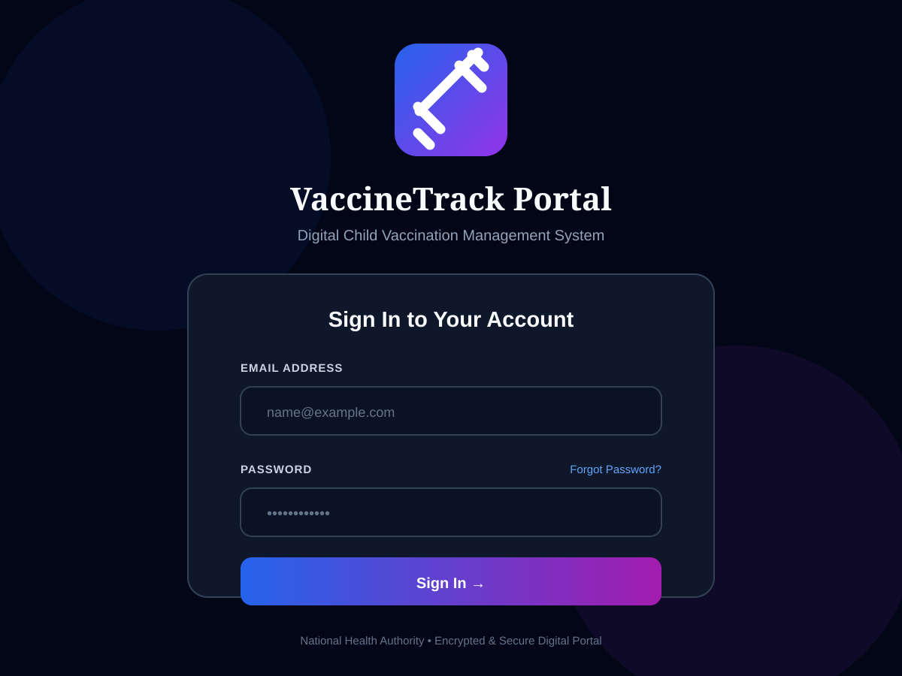

# VaccineTrack Portal

Digital child vaccination management system for parents, healthcare centres, and administrators.



## Overview

VaccineTrack Portal brings vaccination records, due-date tracking, centre discovery, inventory, and administration into one role-based system.

### Main capabilities

- Parent registration and secure login
- Child profiles and digital vaccination cards
- Vaccine schedules with pending, completed, and overdue statuses
- Nearby vaccination centre discovery
- Healthcare centre registration, profile management, and inventory tracking
- Admin review and approval of healthcare centres
- Configurable vaccine schedule rules
- Email/SMS reminder service hooks and scheduled background jobs
- JWT-protected API routes with MySQL persistence

## Technology

- **Frontend:** React 19, Vite, React Router, Tailwind CSS, Lucide React, Axios
- **Backend:** Node.js, Express, MySQL2, JWT, bcryptjs, node-cron
- **Integrations:** Nodemailer, SMS service hooks, optional OpenAI/LangChain integrations

## Project structure

```text
backend/     Express API, authentication, services, routes, and MySQL schema
frontend/    React/Vite web application
docs/        Project documentation assets and UI screenshots
```

## Local setup

### Prerequisites

- Node.js 20 or newer
- MySQL 8 or compatible server

### 1. Configure the database

Create the database and tables using [`backend/db/schema.sql`](backend/db/schema.sql).

### 2. Configure the API

Copy `backend/.env.example` to `backend/.env` and set the MySQL, JWT, and mail credentials.

```powershell
cd backend
copy .env.example .env
npm install
npm run dev
```

The API runs on `http://localhost:5000` by default. Its health endpoint is `GET /api/health`.

### 3. Start the frontend

```powershell
cd frontend
npm install
npm run dev
```

Vite serves the web app at the local URL shown in the terminal, normally `http://localhost:5173`.

## Application routes

| Role | Routes |
| --- | --- |
| Public | `/login`, `/register-parent`, `/register-centre`, `/forgot-password` |
| Parent | `/parent`, `/parent/child/:id`, `/parent/nearby` |
| Centre | `/centre`, `/centre/inventory`, `/centre/profile` |
| Admin | `/admin`, `/admin/rules`, `/admin/centres` |

Protected routes require a valid JWT and the matching account role.

## Useful commands

```powershell
# Frontend
cd frontend
npm run dev
npm run build
npm run lint

# Backend
cd backend
npm run dev
npm start
```

## Security notes

- Never commit `backend/.env` or production credentials.
- Replace the example JWT secret and admin password before deployment.
- Use TLS and production-grade mail/SMS credentials outside local development.

## Status

This repository contains the active frontend and backend implementation for the VaccineTrack Portal.